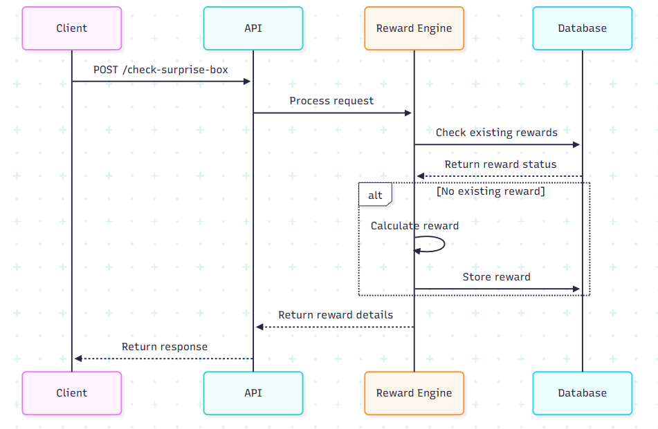

# Karma Surprise Box - Technical Documentation

## Table of Contents
- [Architecture Overview](#architecture-overview)
- [System Design](#system-design)
- [API Documentation](#api-documentation)
- [Data Flow](#data-flow)
- [Configuration](#configuration)
- [Deployment](#deployment)
- [Testing](#testing)
- [Monitoring & Maintenance](#monitoring--maintenance)

## Architecture Overview

Karma Surprise Box is an AI-driven microservice that generates hidden rewards for users based on their daily activity, karma behavior, and engagement patterns. The service determines if a user qualifies for a surprise box, calculates the reward karma, and provides a reason for the reward.

### High-Level Architecture


## System Design

### Core Components
1. **API Layer**: FastAPI-based REST endpoints
2. **Reward Engine**: Handles reward logic and calculations
3. **Database**: SQLite for tracking rewarded users
4. **AI/ML Model**: Predicts reward probabilities
5. **Configuration**: JSON-based configuration system

### Data Model
- **User Activity**: Tracks daily engagement metrics
- **Reward Rules**: Configurable conditions for different reward types
- **Box Types**: Defines reward characteristics and rarities

### Workflow



## Features
- Rule-based reward system with configurable conditions
- AI/ML model integration for reward probability prediction
- Deterministic reward calculation based on user ID and date
- Configurable reward types and rarities
- RESTful API for integration

## Prerequisites
- Python 3.8+
- Docker (for containerized deployment)
- pip (Python package manager)

## Installation

### Local Development
1. Clone the repository
2. Create and activate a virtual environment:
   ```bash
   python -m venv venv
   source venv/bin/activate  # On Windows: venv\Scripts\activate
   ```
3. Install dependencies:
   ```bash
   pip install -r requirements.txt
   ```

## Deployment

### Prerequisites
- Docker 20.10+
- Docker Compose (optional)
- Minimum 1GB RAM
- 1 CPU core

### Docker Deployment
```bash
# Build the image
docker build -t karma-surprise-box .

# Run the container
docker run -p 8000:8000 karma-surprise-box
```


## Configuration

The service is configured using `config.json` in the root directory. Key configuration options include:

### Core Settings
- `reward_probability_threshold`: Minimum probability to qualify for a reward (0.0-1.0)
- `karma_min`/`karma_max`: Bounds for reward karma points
- `reward_rules`: Conditions for different reward types
- `box_types`: Configuration for different box types and their properties

### Environment Variables
- `LOG_LEVEL`: Logging level (DEBUG, INFO, WARNING, ERROR)
- `ENVIRONMENT`: Runtime environment (development, staging, production)

### Security Settings
- `CORS_ORIGINS`: Allowed CORS origins

### Configuration Management
- Environment-specific configuration files
- Secret management (recommended for production)
- Configuration validation on startup

#### Note
- Volume path is given in db_manager.py by default as '/data/karma_rewards.db'

## API Documentation

### Error Handling
Standard HTTP status codes are used:
- 200: Success
- 400: Bad Request
- 404: Not Found
- 500: Internal Server Error

### Response Format
All responses follow the format:
```json
{
  "status": "success|error",
  "data": {},
  "error": null|{
    "code": "ERROR_CODE",
    "message": "Human-readable message"
  }
}
```

## Data Flow
Detailed data flow diagram is available in the `api_flow.md` file.

### Request Flow
1. Client sends daily metrics to `/check-surprise-box`
2. API validates the request
3. Reward Engine processes the metrics
4. Database is checked for existing rewards
5. If eligible, reward is calculated and stored
6. Response is returned to client

### Data Validation
- Input validation using Pydantic models
- Type checking for all fields
- Range validation for numerical values
- Required field validation

### Data Storage
- SQLite database for reward tracking
- JSON configuration files
- In-memory caching (future implementation)

### Data Retention
- Reward history: 90 days
- Logs: 30 days (configurable)
- Backups: 1 year


### Base URL
`http://localhost:8000`

### Endpoints

#### 1. Check Surprise Box
- **Endpoint**: `POST /check-surprise-box`
- **Description**: Check if a user qualifies for a surprise box
- **Request Body**:
  ```json
  {
    "user_id": "stu_9003",
    "date": "2024-07-20",
    "daily_metrics": {
      "login_streak": 5,
      "posts_created": 2,
      "comments_written": 4,
      "upvotes_received": 11,
      "quizzes_completed": 1,
      "buddies_messaged": 2,
      "karma_spent": 35,
      "karma_earned_today": 50
    }
  }
  ```
- **Response**:
  ```json
  {
    "user_id": "stu_9003",
    "surprise_unlocked": true,
    "reward_karma": 15,
    "reason": "Engagement streak + high upvotes",
    "rarity": "rare",
    "box_type": "mystery",
    "status": "delivered"
  }
  ```

#### 2. Health Check
- **Endpoint**: `GET /health`
- **Response**:
  ```json
  {
    "status": "ok",
    "timestamp": "2024-06-26T12:00:00.000000+00:00",
    "service": "Karma Reward Engine",
    "version": "1.0.0"
  }
  ```

#### 3. Version Info
- **Endpoint**: `GET /version`
- **Response**:
  ```json
  {
    "version": "1.0.0",
    "modelVersion": "1.0",
    "last_updated": "2024-06-25T05:00:00Z"
  }
  ```

## Testing

### Test Suite
Comprehensive test cases are implemented in the `tests/` directory. The main test files include:

- `test_api.py`: API endpoint tests
- `testing_4.py`: Extensive test cases for reward engine logic
- `test_endpoints.py`: Endpoint validation tests

Run the test suite:
Note: Run the test files after moving them to api/ directory.
```bash
# Run specific test file - example
pytest testing_4.py -v
```

### Test Coverage
The test suite covers:
- Various user engagement patterns
- Edge cases in reward calculation
- Input validation
- Database operations
- Deterministic reward distribution

### API Testing
1. Start the service
2. Use the Swagger UI at `http://localhost:8000/docs`
3. Test endpoints with sample payloads

## Security Considerations

### Implemented Security Features
- Input validation using Pydantic models
- CORS middleware with configurable settings
- Environment-specific configuration management


## Database

The service uses SQLite with the following features:

### Database Schema
```sql
CREATE TABLE IF NOT EXISTS user_rewards (
    date TEXT NOT NULL,
    user_id TEXT NOT NULL,
    box_type TEXT NOT NULL,
    timestamp DATETIME DEFAULT CURRENT_TIMESTAMP,
    PRIMARY KEY (date, user_id)
)
```

### Data Persistence
- Database file is stored as `/data/karma_rewards.db` in the current working directory
- When running with Docker, you can mount a volume to persist data between container restarts
- Database is automatically initialized on first run with the required schema

### Database Operations
- Tracks rewarded users to prevent duplicate rewards
- Maintains history of all rewards
- Supports querying by date and box type

### Volume Configuration
When running with Docker, ensure to mount a volume for data persistence:
```bash
docker run -d \
  -p 8000:8000 \
  -v karma_data:/data \
  --name karma-surprise-box \
  karma-surprise-box
```

## Monitoring & Maintenance

### Logging
- Basic logging is implemented for critical operations
- Logs are written to stderr by default
- Log level can be configured via the `LOG_LEVEL` environment variable

### Health Check
- `GET /health` endpoint provides basic service status
  - Returns service status, version, and timestamp
  - Example response:
    ```json
    {
      "status": "ok",
      "timestamp": "2024-06-26T12:00:00.000000+00:00",
      "service": "Karma Reward Engine",
      "version": "1.0.0"
    }
    ```

## Maintenance

### Database Maintenance
- **Backup**: Regularly back up the SQLite database file (`karma_rewards.db`)
- **Cleanup**: Manually remove old entries if needed using SQL queries
- **Integrity Check**: Periodically run `PRAGMA integrity_check` on the database

### Version Upgrades
- The service follows semantic versioning
- Database schema changes require manual migration if the structure is modified

## Monitoring Best Practices

1. **Container Logs**: Monitor container logs for errors and warnings
   ```bash
   docker logs -f <container_name>
   ```

2. **Health Check**: Use the `/health` endpoint to verify service status
   ```bash
   curl http://localhost:8000/health
   ```

3. **Database Monitoring**: Check the database file size and integrity
   ```bash
   ls -lh karma_rewards.db
   sqlite3 karma_rewards.db "PRAGMA integrity_check;"
   ```

## Future Enhancements

Potential improvements for future versions:
- Add more detailed metrics and monitoring
- Implement structured logging (JSON format)
- Add request/response logging
- Set up log rotation


